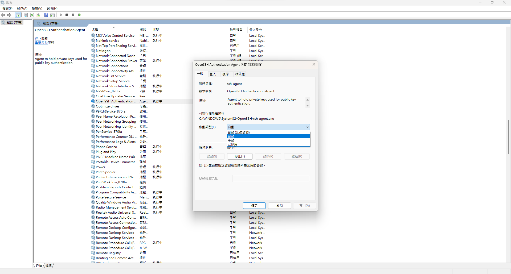

# DataViz Vscode Docker Development Container

## Fix ssh-agent error on windows wsl

**Run two command**
changing the StartupType of the ssh-agent to Manual

```powershell
Set-Service ssh-agent -StartupType Manual
```

start the service

```powershell
Start-Service ssh-agent
```

After that, turn on ssh-agent automatically

1. first: Win + R
2. type services.msc and enter
3. find service called OpenSSH Authentication...
4. turn it auto from manual

